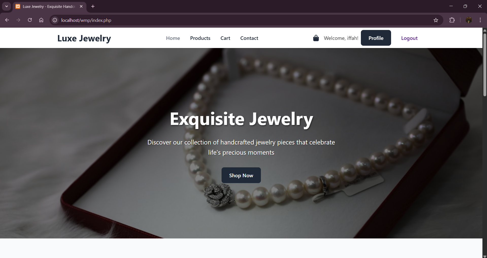
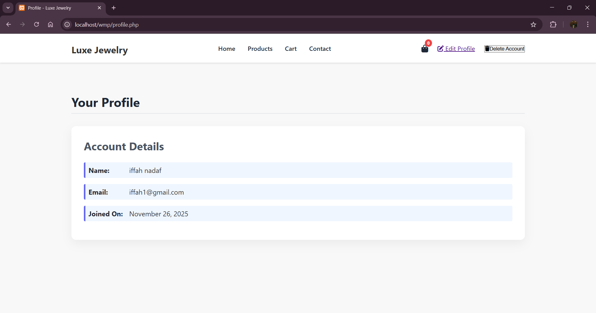
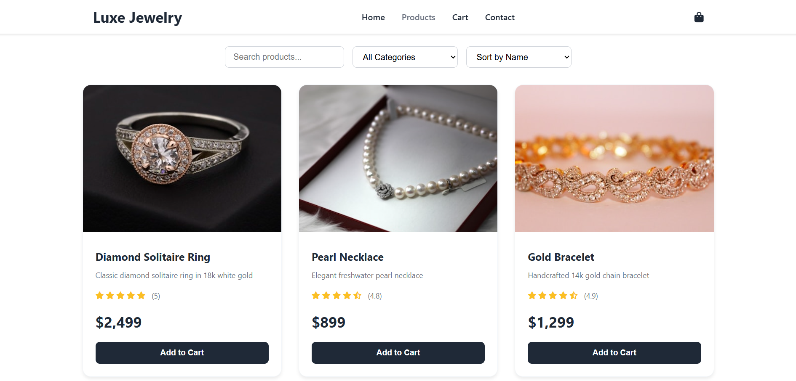
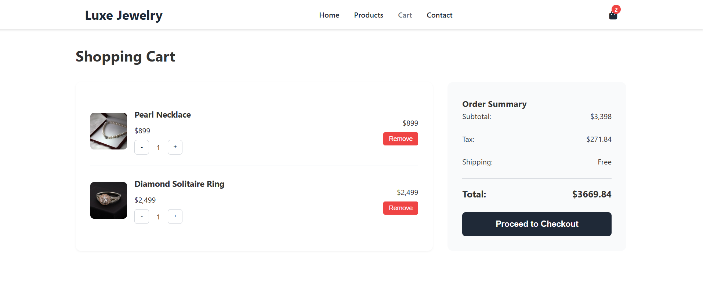
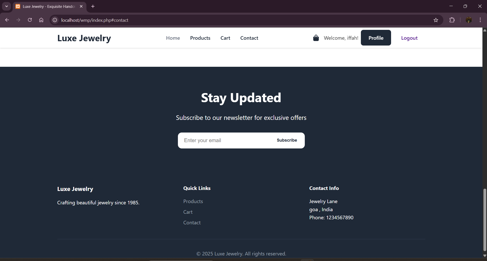

# 💎 Luxe Jewelry — E-Commerce Website

Luxe Jewelry is a simple e-commerce website made as a **college project**.  
Users can browse jewelry items, register, log in, and add or remove products from the shopping cart.

---

### 🧠 Project Purpose

This project was built to learn and practice:

- Backend development using PHP
- Database connectivity using MySQL
- Session handling (Login/Logout)
- CRUD operations
- Full-stack project setup using XAMPP

---

### 🛠 Technologies Used

- HTML  
- CSS  
- JavaScript  
- PHP  
- MySQL (phpMyAdmin)  
- XAMPP (Apache Server)

---

### 🚀 Features

- 🔐 User Signup / Login / Logout
- ✏️ Edit profile
- ❌ Delete account
- 💍 Products page
- 🛒 Add/Remove items from cart
- 📱 Basic responsive design

---

### 📁 Project Structure

jewelry-ecommerce/
│── index.php
│── signup.php
│── login.php
│── logout.php
│── profile.php
│── edit_profile.php
│── delete_account.php
│── products.php
│── cart.php
│── db.php
│── script.js
│── styles.css
│── .gitignore

---

### ▶️ How to Run (Local Using XAMPP)

1. Place the project folder inside: C:\xampp\htdocs\

2. Open **XAMPP Control Panel**
- Start **Apache**
- Start **MySQL**

3. Open **phpMyAdmin**, create a database: luxe_jewelry

4. Create the users table:
on the screen of **phpMyAdmin** select the database: luxe_jewelry , click on sql 
use this code to create Table users.

CREATE TABLE users (
    id INT AUTO_INCREMENT PRIMARY KEY,
    first_name VARCHAR(50) NOT NULL,
    last_name VARCHAR(50) NOT NULL,
    email VARCHAR(100) NOT NULL UNIQUE,
    password VARCHAR(255) NOT NULL,
    created_at TIMESTAMP DEFAULT CURRENT_TIMESTAMP
);

5. Run the project in your browser: http://localhost/jewelry-ecommerce/

---
## Live Preview

Since this project uses PHP & MySQL, it cannot run directly on GitHub.  
Here’s how the website looks:

### Login Page

### Home Page

### Profile Page

### Products Page

### Cart Page

### Checkout Page

---

### 👤 Developer

**Iffah Malik Nadaf**  
Engineering Student | Web Developer  
📚 College Project

---

⭐ *If you like this project, feel free to star the repo!*

